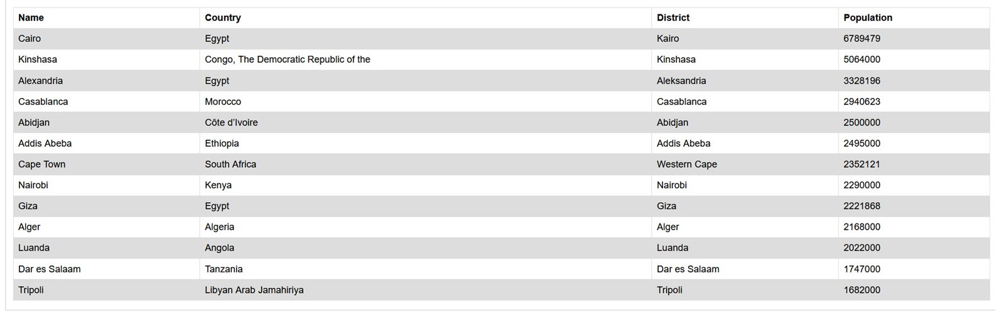
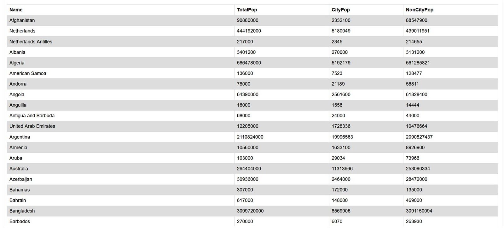

# Group Project for SET08103
 

## Task
Design and implement a new system to allow easy access to population information stored in an SQL database.
  
## Team Members
Mike Lees **[ Product Owner ]** 
Tess Elders **[ Scrum Master ]** 
Daniel Elam 
Erol Birced Lopez De La Cuadra
  
## Reports
| ID    | Name | Met  | Screenshot |
|-------|------|------|------------|
| 1  |   All the countries in the world organised by largest population to smallest. | Yes |  
| 2  | All the countries in a continent organised by largest population to smallest. | Yes |  
| 3  | All the countries in a region organised by largest population to smallest. | Yes |  
| 4  | The top N populated countries in the world where N is provided by the user. | Yes |  
| 5  | The top N populated countries in a continent where N is provided by the user. | Yes |  
| 6  | The top N populated countries in a region where N is provided by the user. | Yes |  
| 7  | All the cities in the world organised by largest population to smallest. | Yes |  
| 8  | All the cities in a continent organised by largest population to smallest. | Yes |  
| 9  | All the cities in a region organised by largest population to smallest. | Yes |  
| 10  | All the cities in a country organised by largest population to smallest. | Yes |  
| 11  | All the cities in a district organised by largest population to smallest. | Yes |  
| 12  | The top N populated cities in the world where N is provided by the user. | Yes |  
| 13  | The top N populated cities in a continent where N is provided by the user. | Yes |  
| 14  | The top N populated cities in a region where N is provided by the user. | Yes |  
| 15  | The top N populated cities in a country where N is provided by the user. | Yes |  
| 16  | The top N populated cities in a district where N is provided by the user. | Yes |  
| 17  | All the capital cities in the world organised by largest population to smallest. | Yes |  
| 18  | All the capital cities in a continent organised by largest population to smallest. | Yes |  
| 19  | All the capital cities in a region organised by largest to smallest. | Yes |  
| 20  | The top N populated capital cities in the world where N is provided by the user. | Yes |  
| 21  | The top N populated capital cities in a continent where N is provided by the user. | Yes |  
| 22  | The top N populated capital cities in a region where N is provided by the user. | Yes |  
| 23  | The population of people, people living in cities, and people not living in cities in each continent. | Yes | 
| 24  | The population of people, people living in cities, and people not living in cities in each region. | Yes |  
| 25  | The population of people, people living in cities, and people not living in cities in each country. | Yes |  
| 26  | The population of the world. | Yes |  
| 27  | The population of a continent. | Yes |  
| 28  | The population of a region. | Yes |  
| 29  | The population of a country. | Yes |  
| 30  | The population of a district. | Yes |  
| 31  | The population of a city. | Yes |  
| 32  | Language Report | Yes |  

 

## Individual Contribution 
| Matriculation Number | Code Review 1 | Code Review 2 | Code Review 3 | Code Review 4 | Final Deliverable |
| -------------------- | ------------- | ------------- | ------------- | ------------- | ----------------- |
| 07011787(M)          | 25            | 25            | 25            | 25            | 25                |
| 40434810(T)          | 25            | 25            | 25            | 25            | 25                | 
| 40445697(D)          | 25            | 25            | 25            | 25            | 25                |
| 40439108(E)          | 25            | 25            | 25            | 25            | 25                | 
| **Total**            | **100**       | **100**      | **100**       | **100**       | **100**           |
